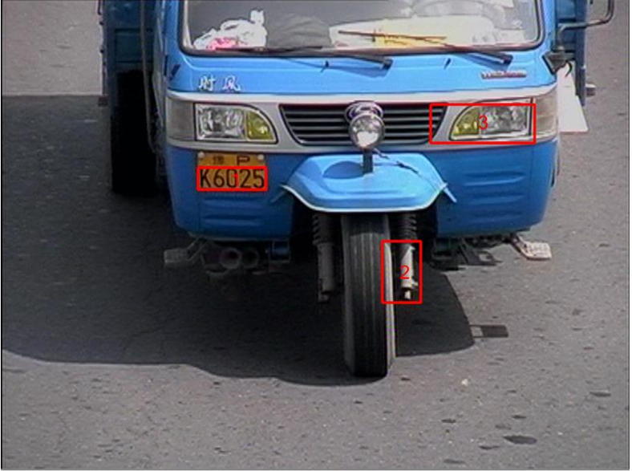
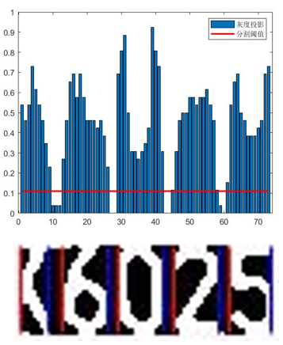
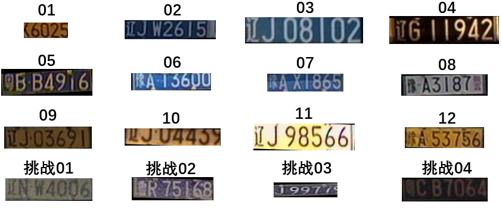

# 车牌定位与字符分割

    陶乐天 2018010771

[toc]

## 1 任务概述

1. 车牌定位：输入车辆图片后，输出mask图以及定位到的车牌图片；
2. 字符分割：根据获得的车牌图片进行字符分割，输出分割后单个字符；
3. 字符识别：在给定模板下对分割出的字符进行识别。

## 2 基本流程

### 2.1 车牌定位

    Fig 1. 车牌定位流程

#### 2.1.1 图像预处理

图像预处理在[preprocess.m](preprocess.m)中，对于输入图像三个通道分别进行中值滤波，避免图像中的突刺噪声，再进行灰度化。如果先进行灰度化再进行中值滤波，噪声可能会因灰度化时平均操作被保留。

#### 2.1.2 边缘检测

边缘检测在[edge_detect.m](edge_detect.m)中，对灰度图像使用不同的梯度算子进行边缘检测，对比不同梯度算子的检测结果。

由于图像中存在许多细节，Roberts、log和Canny算子容易检测出许多无关边缘，不利于后续的区域选择，因此我们选择Sobel算子和Prewitt算子，为了进一步减少被检测的边缘，我们特别选择了垂直方向的检测。

    Fig 2. 边缘检测

#### 2.1.3 形态学操作

形态学操作在[morphology.m](morphology.m)中，输入边缘检测的结果，经过以下四个步骤：

1. 闭运算：先膨胀后腐蚀，用于填补车牌内部的空洞，利于后续检测；
2. 消除小对象：消除和车牌无关的小对象，减少后续的筛选区域；
3. 开运算：先腐蚀后膨胀，用于消除车牌边缘多余检测产生的突刺；
4. 膨胀：扩大筛选区域，避免车牌部分缺失。

经过形态学操作后，车牌所在的矩形框可以被检测出来。

    Fig 3. 形态学操作

#### 2.1.4 重操作判断

重操作判断在[judge.m](judge.m)中，由于部分检测图像所处环境较暗，若不进行直方图均衡化等图像增强操作则难以检测候选区域；部分图像所处环境正常，若全部图像都进行直方图均衡化，则会突出一些无关区域，形成多余的候选区域，不利于后续的区域筛选。

因此在这步判断，不进行均衡化的图像在形态学操作后是否有候选区域，若无则重新进行预处理，此时预处理操作进行了直方图均衡化。这里以挑战图像的04.jpg为例，若预处理时不进行均衡化，则经过形态学操作后无法形成候选区域，因此需要加入均衡化。

    Fig 4. 重操作判断

#### 2.1.5 区域选择

区域选择在[area_select.m](area_select.m)中，对经过形态学操作的候选区域用矩形框出，并用三个规则进行判断：

1. 区域面积：用于剔除面积过小或过大的联通区域，满足条件的区域获得得分1；
2. 车牌颜色：在初始时需要输入车牌的背景颜色，将候选区域所对应的原图转换到HSV空间，黄色所对应的色调H在60°附近，蓝色所对应的色调H在240°附近，计算每个候选区域中满足颜色条件的像素个数和区域大小的比值，将所有候选区中的最大颜色占比归一化为1.5作为得分；
3. 区域比例：比较矩阵长宽比和标准车牌比3.38的大小，满足一定区域获得得分1。

取三个筛选条件的得分总和最大的候选区域作为车牌区域。

    Fig 5. 区域选择

三个候选区域分布得分如下：

| 得分  | 区域面积 | 车牌颜色 | 区域比例 |  总分  |
| :---: | :------: | :------: | :------: | :----: |
| 区域1 |    1     |   1.5    |    1     |  3.5   |
| 区域2 |    1     |  0.9697  |    0     | 1.9697 |
| 区域3 |    1     |  1.2345  |    1     | 3.2456 |

最终选出区域1作为车牌区域。

#### 2.1.6 倾斜校正

倾斜校正在[correction.m](correction.m)中，对车牌区域灰度化和形态学操作后利用霍夫变换进行直线检测，从而得到图中点所集中的角度值，即车牌边框的倾斜角度，从而实现对原图进行修正。

以倾斜较为严重的05.jpg为例说明校正效果。

    Fig 6. 倾斜校正

#### 2.1.7 精确选择

精确选择在[accurate_select.m](accurate_select.m)中。利用色彩信息对车牌区域进行细化，将图像从RGB空间转换到HSV空间，统计每一行每一列满足色调H条件的像素比例，设置阈值，最终用于精确分割车牌边缘。以精确选择效果明显的07.jpg说明。

    Fig 7. 精确选择

### 2.2 字符分割

字符分割在[segmentation.m](segmentation.m)中，将车牌图像二值化后进行灰度投影，设定阈值分割图像。细节上，由于不同背景颜色的车牌灰度化后背景色不一致，因此需要选择占比较大的部分作为背景，即置0。

字符分割的效果很大程度受到之前处理水平的限制，例如倾斜校正就是为了字符分割而采用的。在尝试中发现，对车牌区域进行局部直方图均衡化利于字符分割的进行。

    Fig 8. 字符分割

### 2.3 字符识别

字符识别在[recognition.m](recognition.m)中。将分割字符和输入的模板进行二值化，并将分割字符的大小reshape成输入的模板大小，选择IoU和直接做内积两种方式，识别效果都欠佳。

    Fig 9. 字符识别

## 3 结果分析

### 3.1 车牌定位

车牌定位结果总体较好，算法使用同一套参数能将车牌定位出，一致性较好，但是仍然存在一些问题：

1. 如10.jpg所示，部分车牌没有截取完整；
2. 如挑战03.jpg所示，由于拍摄角度问题，虽然定位出了车牌，但是车牌上的字符被压缩。

    Fig 10. 车牌定位结果

### 3.2 字符分割

字符分割结果如下图所示，分割字符用灰色区域隔开。

    Fig 11 字符分割结果

由于字符分割时没有考虑字宽等先验因素，因此分割结果存在很多干扰字符，主要存在以下问题：

1. 如04.jpg和06.jpg，将汉字部首识别成一个新字符；
2. 如08.jpg所示，将噪声识别成新字符；
3. 如10.jpg所示，字符044没有分开；
4. 如挑战02.jpg和挑战03.jpg所示，由于照片模糊不能正确提取出字符；若此时采用局部自适应二值化方法分割可以让这两张图片正确分割，但是会给其他图片加入噪声。

针对以上问题，考虑在灰度投影前加入车牌局部区域均衡化模块，得到的字符分割结果如下：

    Fig 12 直方图均衡化后字符分割结果

对比未进过直方图均衡化的分割结果，直方图均衡化后有如下提升：

1. 04.jpg的“辽”的分割有了极大的改善；
2. 挑战题02、03能够被二值化找到数字，但03的字符未能成功分割出。

但是08.jpg的后几位数字在均衡化后未能分割出。

### 3.3 字符识别

字符识别效果整体不佳，主要原因是直接将分割字符和模板进行比较，没有考虑两者形状大小方面的差异。事实上我已经进行了一些尝试，例如用形态学操作使得分割得到的字符的粗细和模板一致，但效果依然不佳。

    Fig 13 字符识别结果

尝试优化识别结果。将待识别图片resize与模板图片高度一致，使待识别图片在水平方向逐像素滚动匹配，和模板图像做异或，取值最小的平移像素值，得到的字符识别效果如下，但是效果依然不佳。

    Fig 14 水平滚动字符识别结果

## 4 总结

1. 车牌定位和字符分割基本任务的结果较好，在输入中加入了车牌底色的先验知识，提高了定位和分割的准确性；
2. 算法使用同一套参数基本可以完成车牌定位和分割，算法的一致性较好；
3. 但是由于对分割出的字符进行细化处理，因此字符识别效果较差，下一步将从此方向出发进行优化。

## 5 参考资料

1. [基于matlab的蓝色车牌识别（绪论）](https://blog.csdn.net/Joseph__Lagrange/article/details/95757863)
2. [【图像识别】基于模板匹配车牌识别matlab源码](https://blog.csdn.net/weixin_50197058/article/details/116433070)

